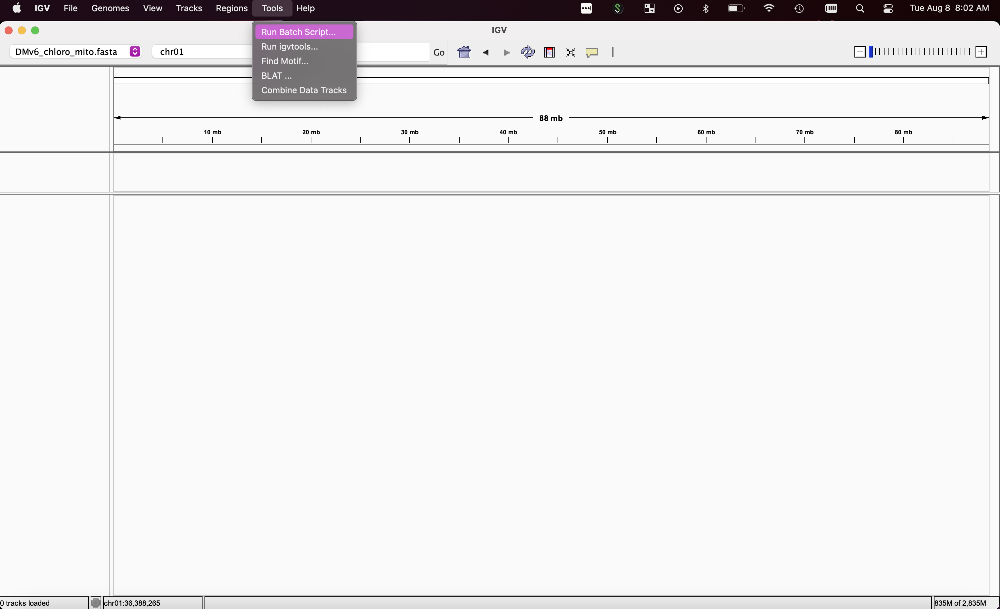
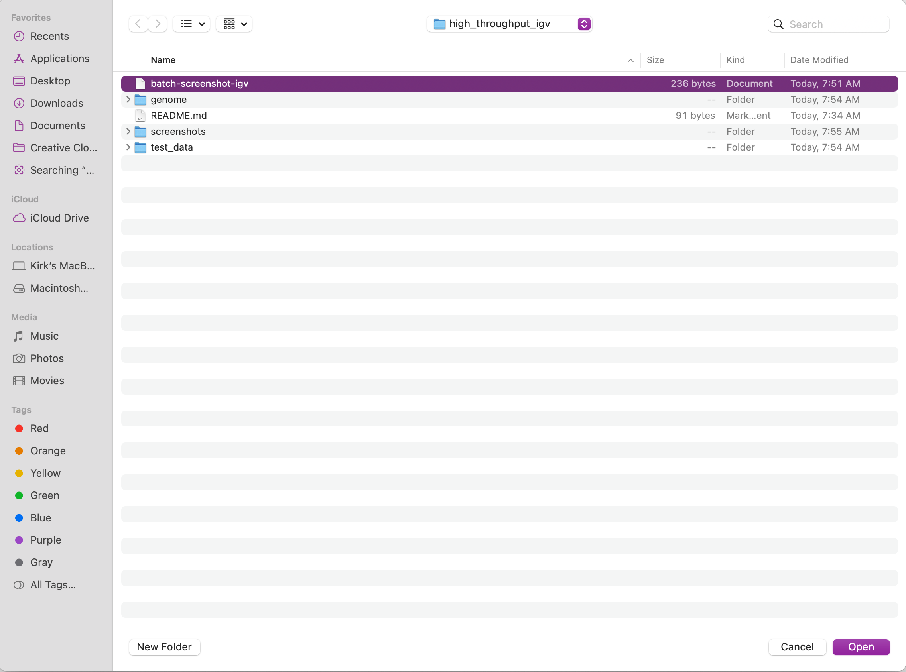

High throughput IGV

Basic demonstration of automated IGV screenshots using a control file
Tested with IGV version 2.16.1

# Installation

Download and install IGV: https://software.broadinstitute.org/software/igv/download

# Minimal test case

Clone this repo to your local:

```
git clone https://github.com/kramundson/igv
```

Open IGV, then select Tools > Run Batch Script



From the window that opens, select ```batch-screenshot-igv``` then selet Open



This will run the commands in ```batch-screenshot-igv```. Screenshot are saved to the ```screenshots``` directory.

batch-screenshot-igv can then be modified for your use case.
Refer to the [IGV docs] for the complete list of batch script commands

[IGV docs]: https://github.com/igvteam/igv/wiki/Batch-commands